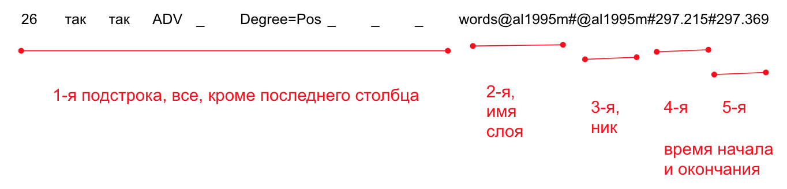

### Разметка жестов, интонационных паттернов, импорт морфологической информации  

1. Создайте слои вида `gesture@aaa1989f`, `gestMeaning@aaa1989f, intonation@aaa1989f для каждого говорящего.   

У слоев `gesture@...` Тип слоев `gestures`, у слоев `gestMeaning@...` Тип слоев `gesture_meaning`. 

В слое `gesture@...` мы будем характеризовать жестовые реплики по внешнему виду: активный орган, характер движения, ориентация (например, левая ладонь обращена вверх или к говорящему), конфигурация, а также наличие препятствий/[спойлеров](https://ruscorpora.ru/new/search-murco.html) или участие предметов/[аксессуаров](https://processing.ruscorpora.ru/search.xml?env=alpha&env=alpha&api=1.0&mycorp=&mysent=&mysize=&mysentsize=&dpp=&spp=&spd=&mydocsize=&mode=murco&lang=ru&sort=i_grtagging&nodia=1&text=lexgramm&ext=10&nolinks=1&ell=1&parent1=0&level1=0&lex1=&gramm1=&sem1=&flags1=&orphoGr1=&orpho1=&strAccent1=&accent1=&before1=&after1=&number1=&parent2=0&level2=0&min2=1&max2=1&lex2=&gramm2=&sem2=&flags2=&orphoGr2=&orpho2=&strAccent2=&accent2=&before2=&after2=&number2=&doc_act_speakersamount=&doc_act_sex=&doc_act_lang=&doc_act_situation=&doc_act_acttypes=&doc_act_appeals=&doc_act_questions=&doc_act_imperatives=&doc_act_modals=&doc_act_negation=&doc_act_pejoratives=&doc_act_praise=&doc_act_consent=&doc_act_trade=&doc_act_assertion=&doc_act_othersspeech=&doc_act_mocking=&doc_act_etiquette=&doc_act_completeness=&doc_act_repetitions=&doc_act_manner=&doc_act_vocals=&doc_gesture_actorname=&doc_gesture_actorsex=&doc_gesture_sex=&doc_gesture_actorage=&doc_gesture_age=&doc_gesture_mainorgan=&doc_gesture_palmorientation=&doc_gesture_handorientation=&doc_gesture_activeorgan=&doc_gesture_passiveorgan=&doc_gesture_adaptor=&doc_gesture_direction=&doc_gesture_mult=&doc_gesture_gesturename=&doc_gesture_gesturetype=&doc_gesture_gesturemeaning=&doc_gesture_extenders=&doc_gesture_spoilers=&doc_gesture_emotions=&doc_gesture_completeness=&doc_gesture_authenticity=&doc_gesture_accessories=%D0%BF%D0%BE%D1%81%D1%83%D0%B4%D0%B0). Характеристики даются в свободной форме: описательно или с использованием известных названий для жестов.  
Граница жестовой реплики включает в себя экскурсию (выход на жест), активную фазу и удержание/рекурсию. Если жесты переходят один в другой, то граница между ними ставится в начале перехода к следующему жесту.  
В слое `gestMeaning@...` указывается (в произвольной форме) [значение жеста](https://ruscorpora.ru/new/search-murco.html) -- его функция в коммуникации: указательный жест, изобразительный жест, поддержка коммуникации (собеседника или собственной речи), выражение эмоции и т.д.

Мы будем использовать упрощенную классификацию типов интонации:   
* `вопрос да-нет`  
* `вопрос специальный`  
* `нарратив`  
* `контраст`  
* `восклицание`  
* `обрыв`
* `неясно`  

Сначала нужно будет создать Тип слоев `intonation` со Стереотипом `Symbolic Association`.   
Затем создать слой для каждого говорящего, указав в качестве родительского слоя слой с репликами.   

2. Импорт из TextGrid  
Файл > Импорт > Текст с разделителями (CSV)  
Укажите, какие столбцы какому типу информации соответствуют (имя слоя, начальное время, конечное время, аннотация).  
После этого нужно указать свойства каждого слоя, так как TextGrid эту информацию не хранит.  
Тип -- Импортируйте типы слоев из файла-образца ELAN или создайте новый тип слоя сами, если нужно, чтобы у вас появились типы `part of speech`, `grammatical features`.  
Слой - Изменить -- задайте свойства слоя (название, метку говорящего, разметчика, родительский слой, язык).  

#### Полезное  

#### Сравнение двух версий разметки  
В Notepad++ установите плагин Compare (Плагины > Менеджер плагинов > Compare > Установить).   
Откройте два файла в редакторе.   
В меню выберите Плагины > Compare > Compare (Plugins > Compare Menu > Compare).  
Скриншоты [тут](https://abuzov.ru/kak-sravnit-dva-fajla).  

#### Подготовка файла c морфологической разметкой к импорту в ELAN  

Сделайте копию вашего файла с морфологической разметкой. Информацию из последнего стобца conllu нужно перенести в отдельные столбцы, поместив их в начале файла. 
В Notepad++ используйте регулярные выражения для замены, чтобы разбить текстовую строку на фрагменты и переставить их местам.      
Например, разобьем мысленно данную строку на пять подстрок, обратив внимание, что символ табуляции `\t` и решетка `#` могут быть использованы как обоначения границ подстрок.  



Найти (в режиме поиска по регулярным выражениями (regex)):   
```^(.*\t)(.*?)#(.*?)#(.*?)#(.*?)$```  

Заменить на:  
```\2\t\4\t\5\t\1```   

Какие символы регулярных выражений мы здесь использовали?
* `.` -- любой символ  
* `.*` -- повтор любого символа от 0 до бесконечного количества раз  
* `.*?` -- то же, но ленивый поиск - до первого элемента, который указан после знака вопроса  
* `\t` -- символ табуляции  
* `^` -- начало строки  
* `$` -- конец строки  
* `\1` -- при замене вставить первую из найденных подстрок (подстрока в поиске указывается скобками)  
* `\2`, `\3`.. -- то же для второй, третьей и т.д. строки  
